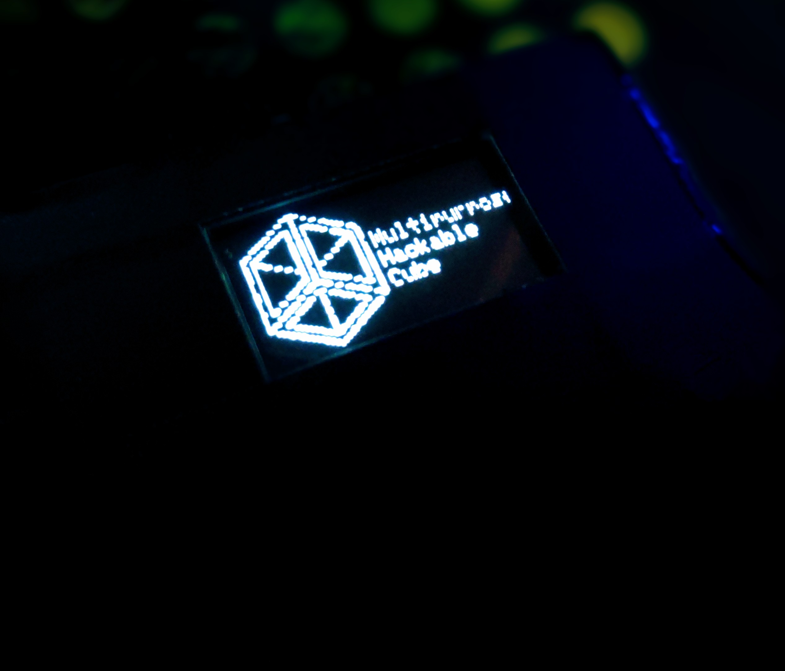
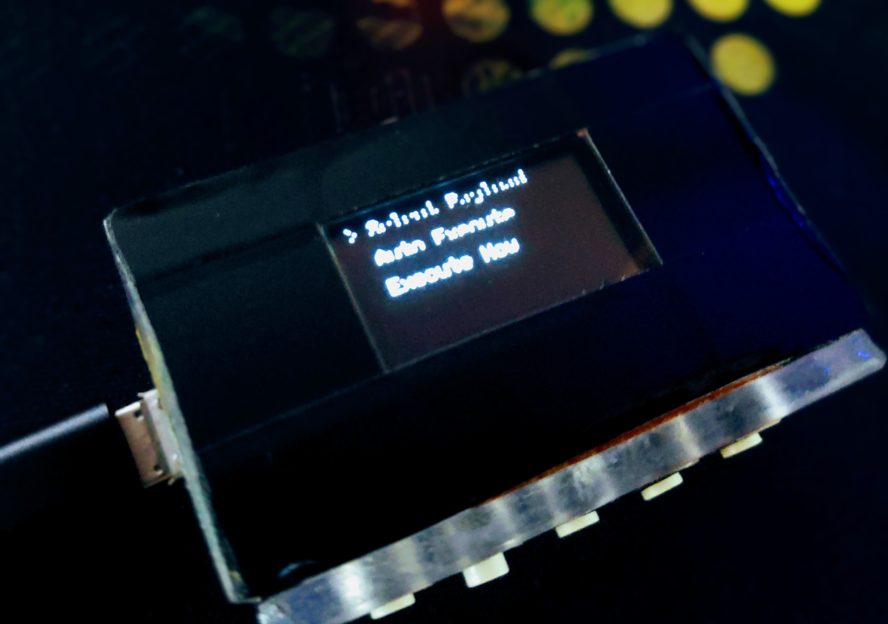
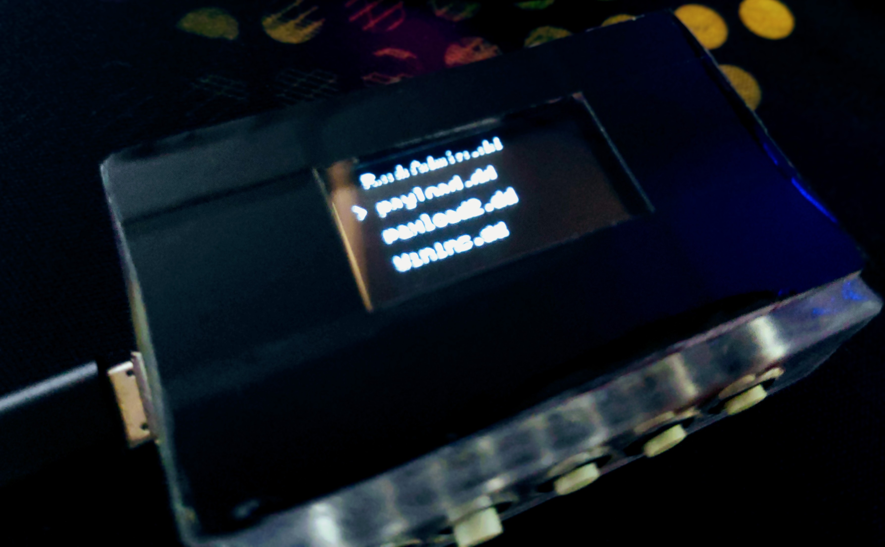

# 🦆 Multipurpose Hackable Cube (MHC) - Raspberry Pi Pico Rubber Ducky with OLED Display
[](images/bootlogo.jpg)
[](images/mainmenu.jpg)
[](images/payloadmenu.jpg)

A feature-rich USB Rubber Ducky implementation using Raspberry Pi Pico with an integrated OLED display and intuitive button interface.

## 🎯 Features

### Core Functionality
- **USB HID Device Emulation**: Emulates keyboard and mouse input
- **Interactive OLED Display**: 128x64 SSD1306 OLED with menu system
- **Multiple Payload Support**: Execute different DuckyScript payloads
- **Temperature Monitoring**: Built-in CPU temperature sensor
- **Auto-Execute Mode**: Automatic payload execution on boot
- **Boot Logo**: Custom boot screen with project branding

### User Interface
- **5-Button Navigation**: Intuitive menu navigation
- **Menu System**: Home screen, main menu, settings, and sub-menus
- **Display Timeout**: Auto-sleep after 30 seconds of inactivity
- **Visual Feedback**: Real-time status and execution feedback

### Advanced Features
- **Payload Management**: Select and manage multiple .dd script files
- **Settings Persistence**: JSON-based configuration storage
- **Boot Modes**: Different startup behaviors based on button combinations
- **Resource Management**: Automatic cleanup and memory optimization
- **Error Handling**: Comprehensive error reporting and recovery

## 🔌 Hardware Requirements

### Main Components
- **Raspberry Pi Pico** (with CircuitPython firmware)
- **SSD1306 OLED Display** (128x64, I2C interface)
- **5 Push Buttons** (for navigation)
- **Pull-up Resistors** (10kΩ recommended for buttons)
- **Breadboard/PCB** for connections

### Pin Connections

#### OLED Display (I2C)
| OLED Pin | Pico Pin | Function |
|----------|----------|----------|
| VCC      | 3V3      | Power    |
| GND      | GND      | Ground   |
| SDA      | GP8      | I2C Data |
| SCL      | GP9      | I2C Clock|

#### Button Layout
| Button | Pico Pin | Function        |
|--------|----------|-----------------|
| UP     | GP0      | Navigate Up     |
| OK     | GP1      | Select/Confirm  |
| DOWN   | GP2      | Navigate Down   |
| BACK   | GP3      | Back/Cancel     |
| MODE   | GP4      | Special Function|

#### Wiring Diagram
```
Pico                    OLED Display
├── GP8 (SDA) ────────── SDA
├── GP9 (SCL) ────────── SCL  
├── 3V3 ───────────────── VCC
└── GND ───────────────── GND

Buttons (with 10kΩ pull-up resistors)
├── GP0 ── [UP Button] ── GND
├── GP1 ── [OK Button] ── GND  
├── GP2 ── [DOWN Button] ── GND
├── GP3 ── [BACK Button] ── GND
└── GP4 ── [MODE Button] ── GND
```

## 💾 Installation

### 1. Prepare Raspberry Pi Pico
1. Download and install [CircuitPython](https://circuitpython.org/board/raspberry_pi_pico/) on your Pico
2. Install required libraries in the `lib` folder:
   - `adafruit_ssd1306.mpy`
   - `adafruit_display_text/`
   - `adafruit_hid/`

### 2. Upload Files
Copy all project files to the root directory of your Pico:
```
/
├── boot.py                 # Boot configuration
├── code.py                 # Main application
├── rubberducky.py         # Payload execution engine
├── settings.json          # Configuration file
├── font5x8.bin            # Display font
├── boot_logo_bitmap_1bit.bmp  # Boot logo
├── lib/                   # CircuitPython libraries
└── payloads/              # DuckyScript files (.dd)
    ├── payload.dd
    ├── payload2.dd
    └── ...
```

### 3. Hardware Assembly
1. Connect the OLED display using I2C (GP8=SDA, GP9=SCL)
2. Wire the 5 buttons to respective GPIO pins with pull-up resistors
3. Power the Pico via USB

## 🎮 Usage

### Boot Modes
Hold buttons during power-on for different modes:

| Button Combination | Mode                    | Description                           |
|-------------------|-------------------------|---------------------------------------|
| None              | Normal Boot             | Standard operation with UI            |
| GP4 Only          | Mass Storage Mode       | Access files, disable auto-execute   |
| GP3 + GP4         | Safe Mode              | Enable mass storage, prevent execution|

### Navigation
- **UP/DOWN**: Navigate through menu items
- **OK**: Select/confirm current item  
- **BACK**: Return to previous menu/cancel
- **MODE**: Special functions (boot combinations)

### Menu Structure
```
Home Screen
├── Main Menu
│   ├── Temperature
│   │   ├── View CPU temperature
│   │   ├── UP: Switch to Celsius
│   │   └── DOWN: Switch to Fahrenheit
│   ├── Rubber Ducky
│   │   ├── Select Payload
│   │   ├── Auto Execute (On/Off)
│   │   └── Execute Now
│   └── Settings
│       └── About
└── (Auto-sleep after 30s inactivity)
```

### Creating Payloads
Create `.dd` files in the `payloads/` folder using DuckyScript syntax:

```ducky
REM This is a comment
DELAY 1000
GUI r
STRING notepad
ENTER
DELAY 500
STRING Hello World!
```

## 📝 DuckyScript Commands

### Basic Commands
| Command | Description | Example |
|---------|-------------|---------|
| `REM` | Comment | `REM This is a comment` |
| `DELAY` | Wait (milliseconds) | `DELAY 1000` |
| `STRING` | Type text | `STRING Hello World` |
| `ENTER` | Press Enter | `ENTER` |
| `TAB` | Press Tab | `TAB` |

### Special Keys  
| Command | Key | Command | Key |
|---------|-----|---------|-----|
| `GUI` / `WINDOWS` | Windows key | `ALT` | Alt key |
| `CTRL` / `CONTROL` | Control key | `SHIFT` | Shift key |
| `ESC` / `ESCAPE` | Escape key | `DELETE` | Delete key |
| `HOME` | Home key | `END` | End key |
| `UP` / `UPARROW` | Up arrow | `DOWN` / `DOWNARROW` | Down arrow |

### Advanced Commands
| Command | Description | Example |
|---------|-------------|---------|
| `DEFAULT_DELAY` | Set default delay | `DEFAULT_DELAY 100` |
| `REPEAT` | Repeat previous line | `REPEAT 5` |
| `IMPORT` | Execute another script | `IMPORT /payloads/other.dd` |
| `LED` | Toggle LED | `LED` |
| `SWIPE` | Mouse swipe gesture | `SWIPE 100 100 200 200 50` |
| `TAP` | Mouse tap | `TAP 150 150` |

## ⚙️ Configuration

### Settings File (`settings.json`)
```json
{
    "auto_execute": false,
    "selected_payload": "payload.dd"
}
```

- **auto_execute**: Automatically run selected payload on boot
- **selected_payload**: Default payload file to execute

### Temperature Units
- Switch between Celsius (°C) and Fahrenheit (°F)
- Use UP/DOWN buttons in Temperature app

### Display Timeout
- Automatic sleep after 30 seconds of inactivity
- Press any button to wake up
- Home screen clock updates every minute

## 🚀 Development

### File Structure
- **`boot.py`**: Handles boot sequence, button detection, and storage modes
- **`code.py`**: Main UI application with menu system and display management
- **`rubberducky.py`**: Payload parsing and execution engine
- **`settings.json`**: Persistent configuration storage

### Adding New Features
1. **New Menu Items**: Add to `menu_items` list in `code.py`
2. **Custom Payloads**: Create `.dd` files in `payloads/` folder
3. **Hardware Additions**: Modify pin assignments in respective files

### Memory Optimization
- Uses `.mpy` compiled libraries for smaller footprint
- Automatic garbage collection
- Resource cleanup on exit

## 🔧 Troubleshooting

### Common Issues

**Display not working**
- Check I2C connections (GP8=SDA, GP9=SCL)
- Verify OLED is 128x64 SSD1306
- Check power (3.3V) and ground connections

**Buttons not responding**  
- Verify pull-up resistors (10kΩ)
- Check button wiring to correct GPIO pins
- Ensure buttons connect to GND when pressed

**Payloads not executing**
- Check file extension (must be `.dd`)
- Verify payload syntax
- Ensure files are in `/payloads/` folder

**Auto-execute not working**
- Check `settings.json` configuration
- Verify selected payload exists
- Check for `no_execute` file

### Debug Mode
Hold GP3+GP4 during boot to enter safe mode with mass storage access.

## 📸 Example Payloads

### Windows Run Dialog
```ducky
GUI r
DELAY 500
STRING calc
ENTER
```

### Open Website
```ducky  
GUI r
DELAY 500
STRING chrome
ENTER
DELAY 2000
CTRL l
STRING https://github.com
ENTER
```

### System Information
```ducky
GUI r
DELAY 500
STRING cmd
ENTER
DELAY 1000
STRING systeminfo
ENTER
```

## 🤝 Contributing

1. Fork the repository
2. Create a feature branch
3. Make your changes
4. Add tests if applicable
5. Submit a pull request

## 📄 License

This project is open source. Please check the license file for details.

## 🙏 Acknowledgments

This uses Rubber Ducky Scripts from [dbisu/pico-ducky](https://github.com/dbisu/pico-ducky) with some modifications.


## 📞 Support

- **Issues**: Report bugs via GitHub issues
- **Documentation**: Check this README for comprehensive information
- **Community**: Join CircuitPython Discord for help

---

**⚠️ Legal Notice**: This tool is for educational and authorized testing purposes only. Users are responsible for complying with applicable laws and regulations.
